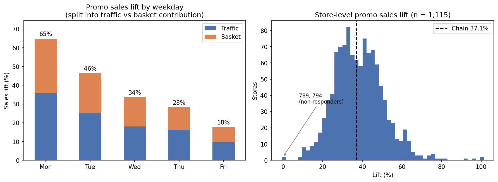
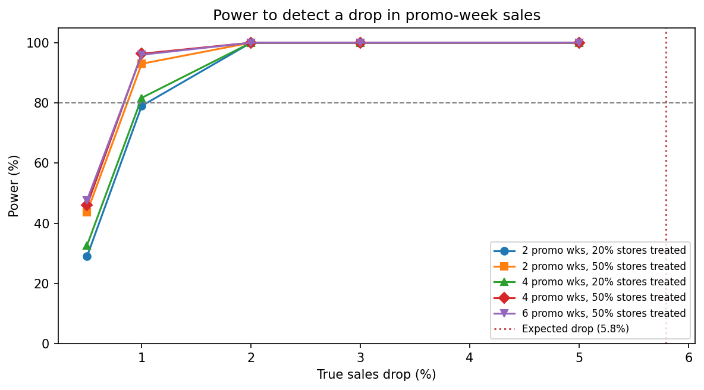

# retail-demand-forecasting

Demand forecasting & inventory planning for 1,100+ retail stores using SQL, Python, Excel, Tableau, and Streamlit.

Built on the Kaggle Rossmann Store Sales data (1,115 German drugstores, Jan 2013 – Jul 2015).

## Tech stack
- **SQL Server 2025 (T-SQL):** data loading, cleaning, weekly aggregation
- **Python:** pandas, scikit-learn, LightGBM, SHAP, matplotlib
- **Excel:** baseline forecasts (seasonal naive, FORECAST.ETS)
- **Tableau** and **Streamlit:** in progress

## Repository structure
```
sql/          T-SQL scripts (load, clean, aggregate)
notebooks/    01_eda, 02_clustering, 03_forecasting, 04_promo_lift
excel/        baselines.xlsx
figures/      exported charts
models/       trained LightGBM model and config
```
Raw and processed data are not tracked; download the data from Kaggle and run the SQL scripts to rebuild.

---

## Step 1 – Data preparation (SQL)
- Loaded 1,017,209 daily store records (1,115 stores, 2013-01-01 to 2015-07-31) into SQL Server.
- 17% of days are closed; 54 open days with zero sales were excluded.
- 180 stores are missing data for Jul–Dec 2014.
- Built a weekly table of 146,025 store-weeks (2,590 partial weeks flagged).

## Step 2 – Exploratory analysis (`01_eda.ipynb`)
- Promo weeks average 34% higher chain sales (43M vs 32M per week), and the effect is front-loaded (Monday +57%, Friday +22%).
- The Dec 11–24 period runs 36% above normal.
- Monday is the strongest day and Saturday the weakest; daily sales are right-skewed (skewness 1.59).

## Step 3 – Store clustering (`02_clustering.ipynb`)
Ward hierarchical clustering on store sales patterns, k = 5 (silhouette 0.134):

| Cluster | Profile | Stores |
|---|---|---|
| 1 | Weekday / promo-sensitive | 414 |
| 2 | Summer / tourist | 8 |
| 3 | Christmas-driven | 173 |
| 4 | Sunday-trading (all 17 type-b stores) | 17 |
| 5 | Balanced week | 503 |

## Step 4 – Excel baselines (`excel/baselines.xlsx`)
- 12-week holdout (May–Jul 2015) on five sample stores, one per cluster.
- Seasonal naive: 6.6% WAPE. FORECAST.ETS: 6.5% WAPE.

## Step 5 – LightGBM forecasting (`03_forecasting.ipynb`)
- **Backtest:** a 4-window rolling backtest of weekly store sales cut WAPE from 11.2% (seasonal naive) to 6.3%, 44% lower.
- **vs Excel:** on the same five stores, LightGBM scored 4.9% WAPE vs 6.5% for Excel ETS.
- **Why naive fails:** the naive baseline broke down when the promo calendar shifted (only 65% alignment in window 1).
- **Hardest segment:** the summer/tourist cluster (8.9% WAPE).
- **Top drivers (SHAP):** store level, then promo days (about +35%), week of year, and open days.

## Step 6 – Promotion lift testing (`04_promo_lift.ipynb`)

**Design.** Promo is chain-wide (every date is 0% or 100% of stores) and weekday-only, so there is no same-day control group. Each promo day was compared with the same store's same weekday one week before and after (non-promo), excluding holidays and December: 223,945 matched pairs across 1,115 stores. Confidence intervals come from a store-level bootstrap.

**Findings**
- **Lift:** +37.1% sales per promo day (95% CI 36.3–37.9%), driven by both traffic (+18.9%) and basket size (+15.3%).
- **Front-loaded:** +65% on Monday, falling to +18% on Friday.
- **Segments:** weekday/promo-sensitive stores lift most (+40.5%); summer/tourist (+17.8%) and Sunday-trading stores (+19.2%) get about half, with traffic barely moving (+7–8%).
- **Stores:** median +37.6% (middle 50%: +29% to +46%). Stores 789 and 794 show no response despite complete history.
- **No cross-week stockpiling:** 11 back-to-back promo weeks show a second promo week performing the same as the first (+0.3%), so the lift is not borrowed from the following week.
- **Mild within-week pull-forward:** Saturdays in promo weeks sell 4.0% less than normal Saturdays.

**Implications**
- Promo spend is least effective in the 25 summer/tourist and Sunday-trading stores; these are candidates for a tailored or reduced promo.
- Because lift fades through the week, a shorter Mon–Wed promo is worth testing.
- Stores 789 and 794 should be reviewed before inclusion in future promos.



---

## Step 7 – Promo experiment design (`05_promo_experiment.ipynb`)

**Question.** Step 6 showed promo lift fading through the week, so would a shorter Mon–Wed promo keep most of the sales at lower cost? This notebook designs a store-level A/B test and sizes it with historical data.

**Design**
- **Expected impact:** dropping Thu–Fri promo should cost at most **5.8%** of promo-week sales (Thu–Fri are 31% of promo-week sales).
- **Metric:** each store vs its own last 8 promo weeks (log ratio of average daily sales), a CUPED-style adjustment that removes **~85% of the noise** (sd 0.31 → 0.04). Using sales per open day keeps stores in the test during holiday weeks.
- **Validation:** 1,000 A/A tests on historical data gave a **3.9% false-positive rate** (target 5%) and no bias.
- **Power:** simulated across 2–6 promo weeks and 20–50% of stores treated. **2 promo weeks with 20% of stores** detects a 2% drop 100% of the time and a 1% drop 79% of the time.
- **Assignment:** 225 test / 890 control stores, stratified by cluster × store size (14 strata); pre-period sales within 0.3%.

**Analysis plan (fixed in advance):** Welch t-test on the capped store-level metric, α = 0.05, with traffic and Saturday sales as guardrails. The test should be scheduled away from Easter, the May–June holidays, and December. Adopt Mon–Wed only if the upper bound of the sales loss is below the promo cost saved.



--

## Coming next
- **Step 8:** Safety stock and reorder points
- **Step 9:** Tableau dashboard
